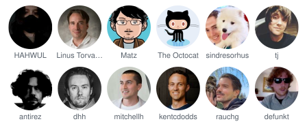

# hall-of-fame

Generate avatar-wall art for your repository — a "hall of fame" of the people who make your project happen. Ships as a GitHub Action (written in [Crystal](https://crystal-lang.org)) that renders your list of users, your contributors, or both into embeddable SVG art and commits it to your repository.

| Grid | Honeycomb | Mosaic |
| :--: | :-------: | :----: |
|  |  |  |

- **Three styles** — classic grid (circle/rounded/square), honeycomb hexagons, and a weight-tiered mosaic where your top contributors literally loom larger.
- **YAML-first** — curate the list yourself (`users`), pull it from the contributors API (`contributors`), or merge both. Weights, display names, links, roles, and avatar overrides per user.
- **Sections & roles** — split the wall into titled groups (say, *Contributors* and *Special Thanks*) and tag people with a role line (*Creator*, *Design*, *Docs*) — made for honoring the folks the contributors API can't see.
- **Self-contained SVGs** — avatars are embedded as base64 data URIs, so the image renders anywhere GitHub shows it (READMEs included, where external loads are blocked).
- **Zero-dependency binary** — pure Crystal stdlib, packaged as a small Alpine container.

## Quick start

Create `.github/hall-of-fame.yml`:

```yaml
source: both              # my list + repository contributors
style: grid
output: HALL_OF_FAME.svg

users:
  - login: hahwul
    name: HAHWUL
    weight: 10

exclude:
  - dependabot[bot]
```

Add a workflow, e.g. `.github/workflows/hall-of-fame.yml`:

```yaml
name: Hall of Fame
on:
  workflow_dispatch:
  schedule:
    - cron: "0 3 * * 0"

permissions:
  contents: write

concurrency:
  group: hall-of-fame

jobs:
  generate:
    runs-on: ubuntu-latest
    steps:
      - uses: actions/checkout@v5
      - uses: crystal-actions/hall-of-fame@v0
```

Then embed the result in your README:

```markdown

```

## Action inputs

| Input | Default | Description |
| ----- | ------- | ----------- |
| `config` | `.github/hall-of-fame.yml` | Path to the config YAML |
| `token` | `${{ github.token }}` | Token for the contributors API (`source: contributors`/`both`) |
| `no_commit` | `false` | Generate files but skip commit/push |
| `commit_message` | `chore: update hall of fame` | Commit message |

Outputs: `svg_path` (comma-separated generated paths), `user_count`, `changed` (whether a commit was pushed).

## Configuration

Everything about the art lives in the config YAML:

```yaml
source: list                # list | contributors | both (default: list)
style: grid                 # grid | honeycomb | mosaic (default: grid)
output: HALL_OF_FAME.svg    # path relative to the repository root

users:                      # your curated list (source: list/both)
  - login: hahwul           # required — GitHub login
    name: HAHWUL            # optional display name (default: login)
    weight: 10              # optional, drives mosaic sizing + weight sort
    role: Creator           # optional label under the name (grid) / in tooltips
    group: Contributors     # optional section this user renders in
    link: https://hahwul.com          # optional (default: the GitHub profile)
    avatar_url: https://…/custom.png  # optional avatar override

groups: [Contributors, Special Thanks]  # optional: section order (and typo guard)

contributors:               # used when source is contributors/both
  repo: owner/name          # default: the current repository
  include_bots: false       # keep type=Bot / *[bot] accounts
  include_anonymous: false  # include anonymous (email-only) contributors
  max: 100                  # cap fetched contributors; contributions become weight
  group: Contributors       # optional section for API-fetched users

exclude:                    # drop logins from any source
  - dependabot[bot]

sort: weight                # weight | login | none (none keeps list order)
limit: 60                   # cap rendered users after merge/sort
fail_on_missing: false      # true: fail the run when an avatar can't be fetched

outputs:                    # optional: render several files in one run
  - path: docs/wall-grid.svg
  - path: docs/wall-hex.svg
    style: honeycomb

grid:
  columns: 8
  avatar_size: 64
  shape: circle             # circle | rounded | square
  margin: 8
  show_names: true
  truncate: 12              # max name length (0 = no truncation)

honeycomb:
  columns: 9
  cell_size: 72
  gap: 4

mosaic:
  width: 800
  base_cell: 48
  tiers: [3, 2, 1]          # cell spans per weight tier (top tier first)
  gap: 2

theme:
  background: transparent
  label_color: "#57606a"
  role_color: "#6e7781"     # the role line under names
  title_color: "#24292f"    # section titles
  font_family: "-apple-system, 'Segoe UI', Helvetica, Arial, sans-serif"
```

When `source: both`, your `users` entries win over API data field by field — set a custom `name` or `weight` while the contribution count fills everyone else's. Users without a `group` render first in an untitled section; groups follow the `groups` order (or first mention in the config). This is the recipe for honoring people the API misses — unlinked commit emails, design or docs work: add them to `users` with a `role` and their own section.

## Notes

- The workflow needs `permissions: contents: write` to push the generated file, and a `concurrency` group avoids racing pushes on busy repositories.
- On `pull_request` events the checkout is a detached HEAD, so pushes fail — use push/schedule/dispatch triggers, or set `no_commit: true` and handle the file yourself.
- SVG size grows with user count (roughly 5–15 KB per avatar). Use `limit` and moderate avatar sizes for large walls.

## CLI

The action binary is also a local CLI:

```bash
shards build --release
bin/hall-of-fame --config examples/showcase.yml   # writes examples/*.svg
bin/hall-of-fame -c my.yml --commit               # opt in to commit/push locally
```

## Development

```bash
shards install
crystal spec                    # unit + golden-file specs (no network)
UPDATE_GOLDEN=1 crystal spec    # regenerate golden SVGs after renderer changes
crystal tool format
bin/ameba src spec
```

Release flow: pushing a `v*` tag builds a multi-arch image to `ghcr.io/crystal-actions/hall-of-fame` and force-moves the major tag (`v0`, `v1`, …). The image is pushed before the git tag moves, so the moving tag always references an existing image.

## License

MIT — see [LICENSE](LICENSE).
